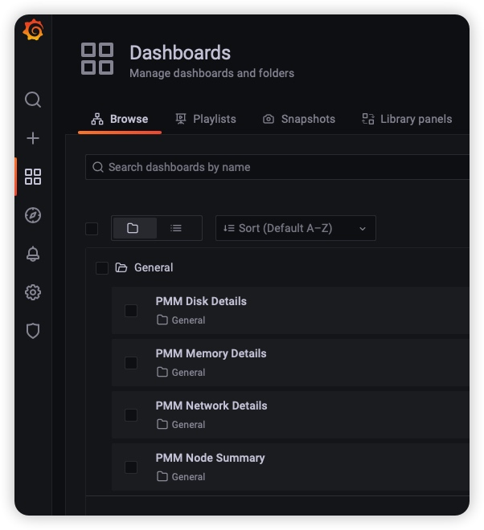
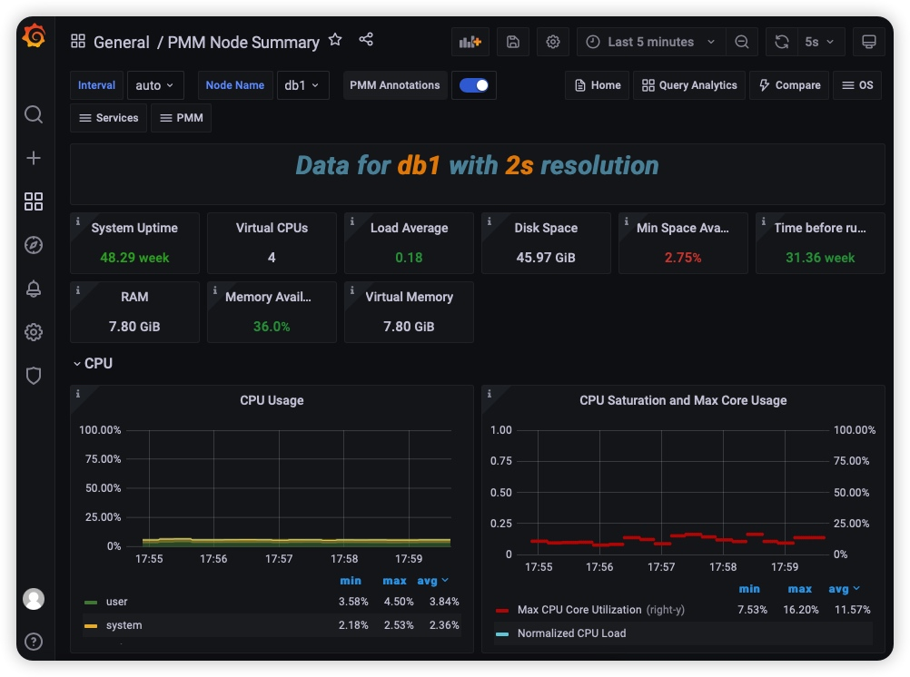
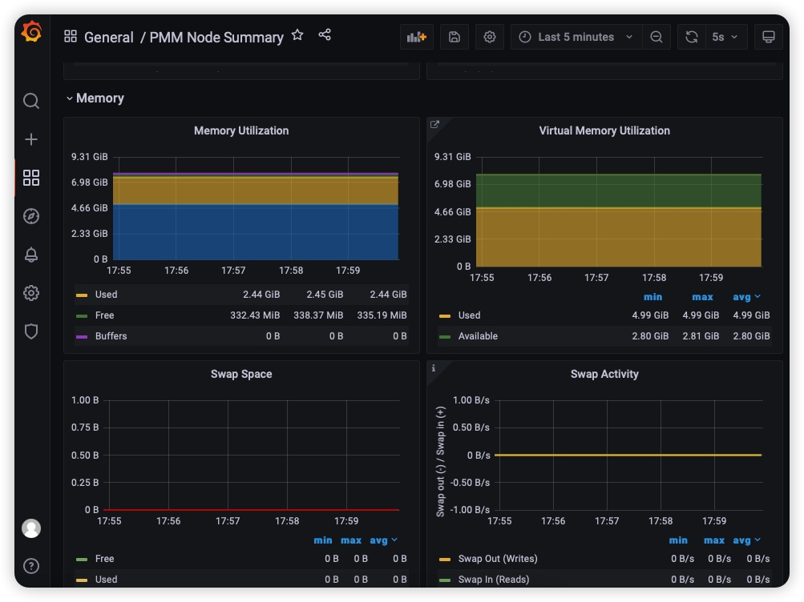
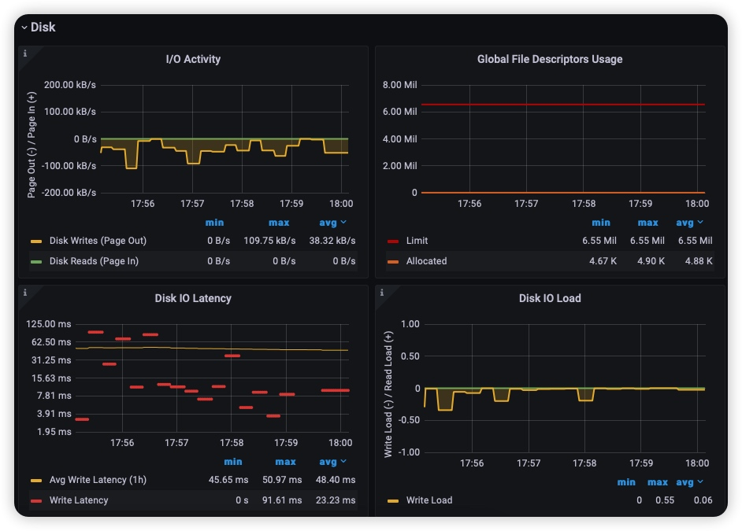
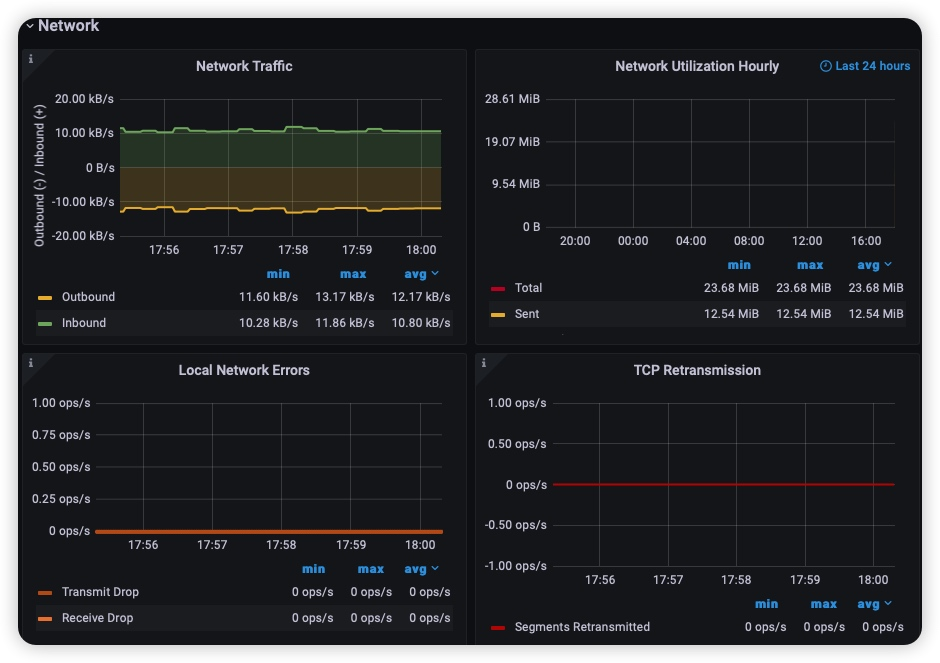

## 简介
此整合平台使用了Percona PMM的Dashboards + grafana +prometheus ，执行安装脚本一键监控服务器上的cpu，磁盘，内存，网络等性能,无需配置繁琐的Dashboard仪表盘,开箱即用

使用的组件如下:
Grafana v8.3.4 
Prometheus 2.33.1
node_exporter 0.17.0

测试情况

CentOS6:ok

CentOS7:ok


`PMM的Dashboard`



`性能总览`



`内存`



`IO`



`网络`




`说明:`
1、client_node_node_exporter.zip包含了node_exporter采集器以及添加到系统的服务,即客户端
2、server_grafana_prometheus.zip包含了grafana，prometheus应用程序，以及添加到系统的服务，即服务端

## 部署
###一、被监控端
1、在被监控的机器上传客户端到opt目录监控工具并解压
```bash
[root@orcldb4 opt]# ll -hrt /opt/client_node_node_exporter.zip 
-rw-r--r-- 1 root root 7.1M Jun  1 14:12 /opt/client_node_node_exporter.zip

[root@orcldb4 opt]# unzip client_node_node_exporter.zip 
```

2、进入到服务安装目录
```bash
[root@orcldb4 client_node_node_exporter]# cd /opt/client_node_node_exporter/install_service_script/
```

3、安装node_exporter到系统服务
```bash
[root@orcldb4 install_service_script]# sh fast_install_client_node_exporter.sh 
you can enter service node_exporter start
服务安装好之后会自动添加到开机自启
```

4、启动服务

`CentOS6:`

```bash
[root@orcldb4 install_service_script]# service node_exporter start
Starting node_exporter...                                  [  OK  ]
```


`CentOS7:`

```bash
[root@orcldb4 install_service_script]# systemctl start node_exporter

检查进程是否启动
(base) [root@db1 install_service_script]# ps -ef|grep node_exporter
root     18718     1  0 17:18 ?        00:00:00 /opt/client_node_node_exporter/node_exporter                             [  OK  ]
```


5、访问采集器测试

http://ip:9100/metrics


### 二、监控的服务端

1、在server端上传服务端工具到opt目录(对外提供展示以及存储监控数据的服务器)并解压

```bash
[root@orcldb5 opt]# ll -hrt /opt/server_grafana_prometheus.zip 
-rw-r--r-- 1 root root 154M Jun  1 14:17 /opt/server_grafana_prometheus.zip


[root@orcldb5 opt]# unzip server_grafana_prometheus.zip 
```

2、安装服务

```bash
[root@orcldb5 opt]# cd /opt/app/install_service_script/
[root@orcldb5 install_service_script]# sh fast_install_monitor_service.sh 
执行脚本的时候会提示输入node_exporter客户端的地址，即被监控的机器
enter node exporter client ip:192.168.212.233
```

3、启动grafana跟prometheus


`CentOS6`

```bash
[root@orcldb5 install_service_script]# service prometheus start


Starting Prometheus Server...                              [  OK  ]

[root@orcldb5 install_service_script]# service grafana-server start


Starting Grafana Server: ...                               [  OK  ]
[root@orcldb5 install_service_script]# 


```


`CentOS7`

```bash

[root@orcldb5 install_service_script]# systemctl start prometheus
[root@orcldb5 install_service_script]# systemctl start grafana

```


### 三、访问grafana

visit prometheus http://server_ip:9090
visit grafana http://server_ip:3000 username:admin password:admin


